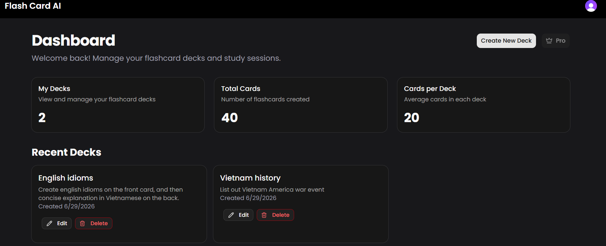
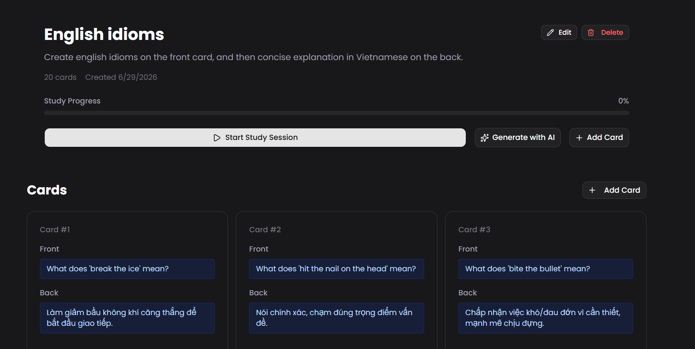
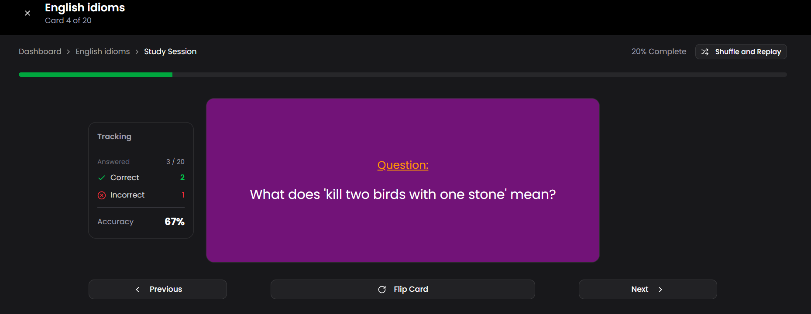

# Flash Card AI

A full-stack flashcard learning platform with AI-powered card generation, user authentication, and subscription-based feature gating. Built as a portfolio demo to showcase practical AI engineering skills in a production-style Next.js application.

**Live demo:** https://flashcardai-delta.vercel.app 

---

## Why This Project

This app demonstrates how to integrate LLMs into a real product — not as a standalone script, but as a secure, typed, user-facing feature inside a modern web stack. It covers the full lifecycle: auth, persistence, billing gates, structured AI output, and a polished UI.

## Features

### Core Learning Experience

- **Deck management** — Create, edit, and delete flashcard decks
- **Manual card CRUD** — Add, edit, and remove individual cards
- **Study mode** — Flip cards, navigate, shuffle, and track correct/incorrect answers with progress stats

### AI-Powered Generation (Pro)

- **One-click generation** — Pro users can generate 20 flashcards from a deck's title and description
- **Structured outputs** — Uses the Vercel AI SDK with Zod schemas so LLM responses are validated before saving

### Authentication & Billing

- **Clerk authentication** — Sign up / sign in via modal flows
- **Route protection** — Middleware redirects unauthenticated users to the homepage
- **Clerk Billing** — Free vs Pro plans with feature-based access control

| Plan | Decks | AI Generation |
|------|-------|---------------|
| Free | Up to 2 | No |
| Pro  | Unlimited | Yes |

---

## Tech Stack

| Layer | Technology |
|-------|------------|
| Framework | [Next.js 16](https://nextjs.org/) (App Router, Server Components, Server Actions) |
| Language | TypeScript |
| Auth & Billing | [Clerk](https://clerk.com/) |
| Database | [Neon Postgres](https://neon.tech/) |
| ORM | [Drizzle ORM](https://orm.drizzle.team/) |
| AI | [Vercel AI SDK](https://sdk.vercel.ai/) + [OpenAI](https://openai.com/) |
| UI | [shadcn/ui](https://ui.shadcn.com/) + Tailwind CSS v4 |
| Validation | [Zod](https://zod.dev/) |

---

## Screenshots

---

## License

This project is for portfolio and demonstration purposes.
